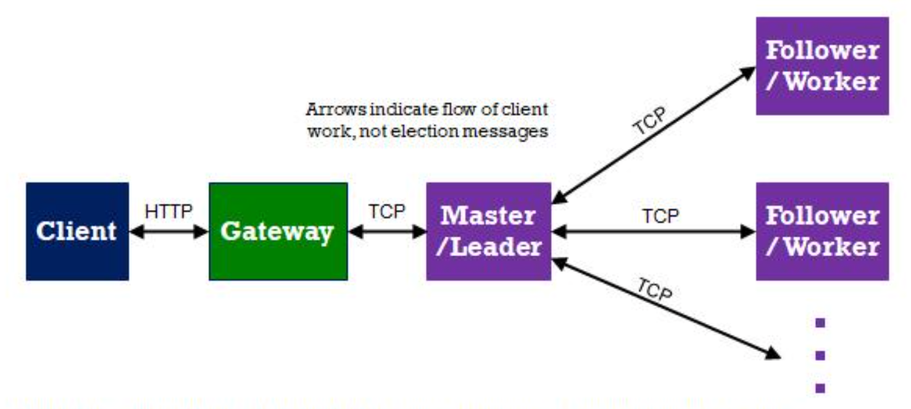

# Distributed-Java-Runner

Distributed, Fault-Tolerant, Serverless Computing for Java Programs

This system was built as part of the Yeshiva University COM3800 (Intro to Distributed Systems) course.

### Overview

This system is a service which provides serverless execution of Java code.


*Architecture of the system*

Clients send an HTTP request to the gateway which passes the work on to the master who distributes the work among multiple worker nodes. The result of the work is then sent up the chain back to the client.

The cluster utilizes a leader election algorithm to determine which node will be the leader. The Gateway observes cluster activity so it remains aware of which node is the leader. Gossip-Style Heartbeats are used to detect node failures. If a node fails, work is redistributed and, if necessary, a new leader is elected.

#### HTTP service to retrieve failure detection logs:

To retrieve failure detection logs, make an HTTP GET request to the node's UDP port + 4. For the summary log file, use the path `/summary` and for the verbose logs, use the path `/verbose`.

For example, if you wanted to retrieve the verbose log file for the node on UDP port 8010, you would use:

```bash
curl localhost:8014/verbose
```

#### HTTP service to find leader:

To ask the gateway who the leader is, send an HTTP GET request to the gateways HTTP port (same as if you are sending a client request) and the path `/leader`
